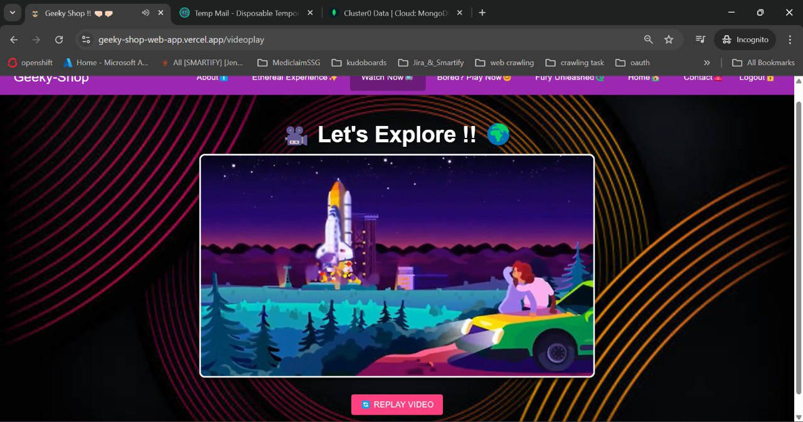
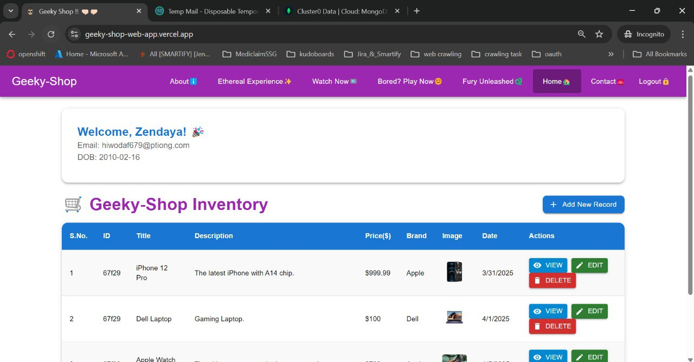
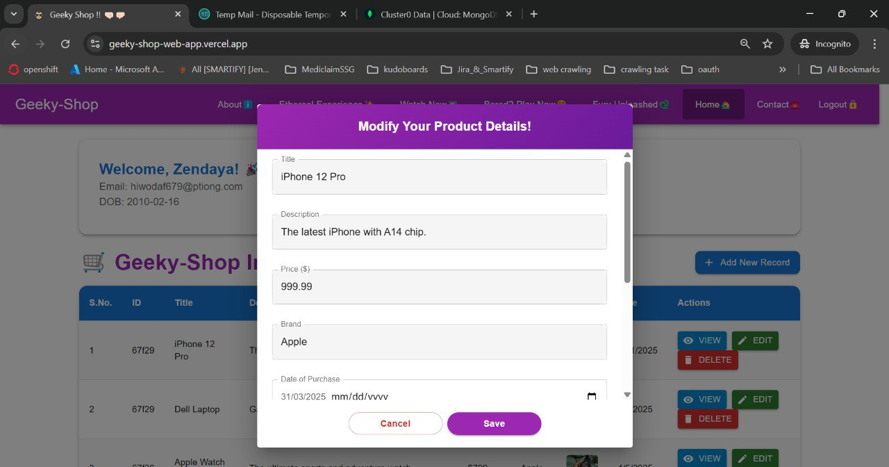

<h1 align="center">🛍️ Geeky Shop - Full Stack Web App</h1>

<p align="center">
  <a href="https://geeky-shop-web-app.vercel.app/"><strong>Live Demo</strong></a>   •   
  <a href="https://geeky-shop-web-app.vercel.app/contact"><strong>Contact Me</strong></a>
</p>

**Geeky Shop** is a full-stack web application built with React, Vite, and TypeScript for the frontend and Node.js for the backend. The app offers a seamless experience to geek lovers by allowing them to manage an inventory of techie products, access fun games, and relax through immersive media.

---

## ✨ Features

### 🔐 Authentication
- **Register/Login**: Secure signup and login functionality.
- **Forgot Password**: Recover your account easily.
- **Protected Routes**: Inventory and games are available only after login.

### 🏠 Home (Post Login)
- **CRUD Operations** on geeky product inventory (Create, Read, Update, Delete).
- **Add Techie Record**: Quickly add geek products to the table.
- **Delete Option**: Easily remove outdated entries.
- **Secret Game**: 🎮 *Fury Unleashed* → Classic Snake Game (unlocks after login).

### 🌐 Public Screens (Accessible without Login)
- **About**: Brief description of the Geeky Shop application.
- **Ethereal Journey**: A relaxing visual and audio experience to unwind.
- **Interesting Video**: Watch fascinating, curated content.
- **Memory Match Challenge**: A fun, interactive board game for everyone.
- **Contact**: Reach out via the in-built contact form.

---

## 🛠️ Installation & Running

Clone this repository to your local machine:
```bash
    git clone https://github.com/deepanshubajaj/GeekyShop-WebApp.git
```

### 🚀 Frontend

```bash
    cd GeekyShop-Frontend
```
```bash
    npm install
```
```bash
    npm run dev     # For local development
```
```bash
    vite build   # For production build using Vite or - ' npm run build '
```
### ⚙️ Backend

```bash
    cd login_server
```
```bash
    npm install
```
```bash
    npm install -g nodemon  # Run once for local dev setup
```
```bash
    nodemon server.js       # For local development
```
```bash
    node server.js          # For production
```

---

### 🖼️ UI Sneak Peek

<p align="center">
  
</p>

<p align="center">
  *Screenshot of About Page.*
</p>

<p align="center">
  
</p>

<p align="center">
  *Screenshot of Ethereal Journey Page.*
</p>

<p align="center">
  
</p>

<p align="center">
  *Screenshot of Watch Now Page.*
</p>

<p align="center">
  
</p>

<p align="center">
  *Screenshot of Memory Game Page.*
</p>

<p align="center">
  
</p>

<p align="center">
  *Screenshot of Login Page.*
</p>

<p align="center">
  
</p>

<p align="center">
  *Screenshot of Register Page.*
</p>

<p align="center">
  
</p>

<p align="center">
  *Screenshot of Home Page.*
</p>

<p align="center">
  
</p>

<p align="center">
  *Screenshot of Add Dialog.*
</p>

<p align="center">
  
</p>

<p align="center">
  *Screenshot of View Dialog.*
</p>

<p align="center">
  
</p>

<p align="center">
  *Screenshot of Edit Dialog.*
</p>

<p align="center">
  
</p>

<p align="center">
  *Screenshot of Forgot Password Page.*
</p>

<p align="center">
  
</p>

<p align="center">
  *Screenshot of Forgot Password Reset Code Dialog.*
</p>

<p align="center">
  
</p>

<p align="center">
  *Screenshot of Reset Password Page.*
</p>

<p align="center">
  
</p>

<p align="center">
  *Screenshot of Secret Snake Game (1) Page.*
</p>

<p align="center">
  
</p>

<p align="center">
  *Screenshot of Secret Snake Game (2) Page.*
</p>


---

## 📱 Live Demo

- 🌐 [Geeky Shop Live](https://geeky-shop-web-app.vercel.app/)

- 📩 [You can Contact Me](https://geeky-shop-web-app.vercel.app/contact)

---

## 🧠 Tech Stack

<p align="center">
  <table>
    <tr>
      <th>Frontend</th>
      <th>Backend</th>
      <th>Tools/Services</th>
    </tr>
    <tr>
      <td>React + Vite</td>
      <td>Node.js</td>
      <td>TypeScript</td>
    </tr>
    <tr>
      <td>Tailwind CSS</td>
      <td>Express.js</td>
      <td>Vercel (Hosting)</td>
    </tr>
    <tr>
      <td>React Router</td>
      <td>Nodemon</td>
      <td>EmailJS / Contact</td>
    </tr>
  </table>
</p>


---

## 🚀 Working App Demo

### Complete App Working Video

Check out the demo of the working app below:

[Watch the Working Demo](https://github.com/user-attachments/assets/f379939e-10f7-4c70-864d-15b0b5558f80)

### Forgot Password and Reset Password Working Video

[Watch the Working Demo](https://github.com/user-attachments/assets/6378a5b5-7f11-4e73-b3e5-864a454eea03)

### Ethereal Journey Page Working Video

[Watch the Working Demo](https://github.com/user-attachments/assets/89113709-2a43-46fc-934b-43c5a8164367)

### Entertaining and Knowledgeable - Watch Now Working Video

[Watch the Working Demo](https://github.com/user-attachments/assets/708f27aa-6dd1-4e7a-b12d-883f101b0cad)

### Memory Game Page Working Video

[Watch the Working Demo](https://github.com/user-attachments/assets/3001f413-39b0-44f2-b10a-6d06df6348f2)

### Secret Snake Game Page Working Video

[Watch the Working Demo](https://github.com/user-attachments/assets/18632235-2849-47a3-a6d0-8483c62a160b)


---

## 🤝 Contributing

I welcome contributions to **Geeky Shop**! If you want to contribute, follow these steps:

1. Fork the repository.
2. Create a new branch (`git checkout -b feature-name`).
3. Make your changes or improvements.
4. Commit your changes (`git commit -am 'Add some feature'`).
5. Push to your branch (`git push origin feature-name`).
6. Open a Pull Request!

Every contribution makes the project better. Thanks for helping out! ✨

---

**Note:** **No contributions are currently accepted for this project.** Feel free to use or explore the code as you wish, but please note that modifications or additions are not allowed unless explicitly authorized by the owner - **Deepanshu Bajaj**.

## 📃 License

This project is **"All Rights Reserved"**. You may not use, modify, or distribute this code without the explicit permission of the owner - **Deepanshu Bajaj**.

